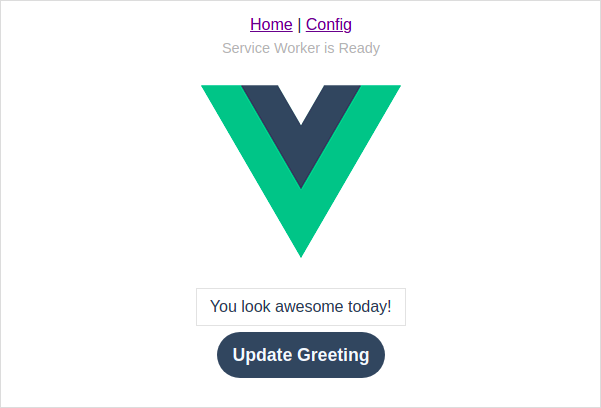
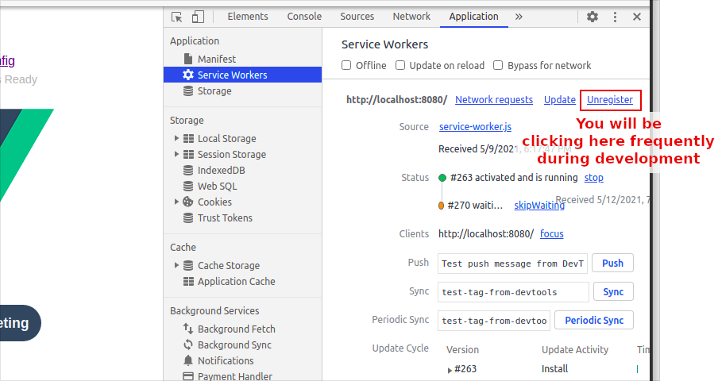

# service-worker-experiment

Worker is a powerful tool.
Yet, it can easily drive you into a rabbit hole
when implementing the related Web APIs.
With this sample, I wish to demonstrate and clarify
the use of the most basic Web APIs related with Workers.

[1. About](#1-about)  
[2. Dev + Build](#2-dev--build)  
&nbsp; &nbsp; [2-1. Dev](#2-1-dev)  
&nbsp; &nbsp; [2-2. Build](#2-2-build)  
[3. What I Did](#3-what-i-did)  
&nbsp; &nbsp; [A. Useful Resources on Service Worker](#a-useful-resources-on-service-worker)  
&nbsp; &nbsp; [B. Workbox](#b-workbox)  
&nbsp; &nbsp; [C. Cache Strategies (using Workbox)](#c-cache-strategies-using-workbox)  
&nbsp; &nbsp; [D. `Clients API` over `MessageChannel`](#d-clients-api-over-messagechannel)  
&nbsp; &nbsp; [E. Immediate Activation](#e-immediate-activation)  
&nbsp; &nbsp; [F. Event Types](#event-types)  
[4. Installed NPM Packages](#4-installed-npm-packages)  
&nbsp; &nbsp; [4-1. All](#4-1-all)  
&nbsp; &nbsp; [4-2. Babel](#4-2-babel)  
&nbsp; &nbsp; [4-3. ESLint + Prettier](#4-3-eslint--prettier)  
&nbsp; &nbsp; [4-4. TypeScript](#4-4-typescript)  
&nbsp; &nbsp; [4-5. Jest](#4-5-jest)  
&nbsp; &nbsp; [4-6. Vue](#4-6-vue)  
&nbsp; &nbsp; [4-7. Webpack](#4-7-webpack)  
&nbsp; &nbsp; [4-8. Other Build Tools](#4-8-other-build-tools)  
[5. LICENSE](#5-license)



[View Demo](https://tokyo800.sakura.ne.jp/mina/sw/)

## 1. About

Mainly focuses on 2 features:  
(1) **_Cached Routes_** using Workbox, and  
(2) **_Messaging_** using Clients API.

#### # Overview

- Using Workbox for cached routes (per resource)
- Using [Clients API](https://developer.mozilla.org/en-US/docs/Web/API/Clients) for messages between worker and client
- Using [Cache API](https://developer.mozilla.org/en-US/docs/Web/API/Cache) to check if cache exists
- A button click to remove cache (sending `REFRESH` to the worker)
- A button click to unregister service worker
  (using [ServiceWorkerRegistration.unregister()](https://developer.mozilla.org/en-US/docs/Web/API/ServiceWorkerRegistration/unregister))

See _[3. What I Did](#3-what-i-did)_ for feature details.

#### # Bonus

- TypeScript users may find it useful for examples presented
  (see _["Why I hate TypeScript"](https://github.com/minagawah/ts-setup-2021-library/#-why-typescript)_)
- Same goes for Vue users for examples using Vuex and Vue specific features

#### # Tech Spec

- Vue 2 (Vue 3 is still not ready for some libraries)
- Babel 7 (for TypeScript compilation)
- Webpack 5
- Vuex
- Vue Router
- Jest (`babel-jest` instead of `ts-jest`)

&nbsp;

## 2. Dev + Build

### 2-1. Dev

```
yarn start
```

When debugging, you may need to frequently click `Unregister` provided by Chrome developer console's `Application` pane.



#### # Inspecting Service Workers with Chrome

If you are using Chrome for development, you can open a separate tab for another developer console for the worker process:

```
# Access either of the following:

chrome://inspect/#service-workers

# or

chrome://serviceworker-internals
```

### 2-2. Build

```
yarn prod
```

&nbsp;

## 3. What I Did

Essential parts around Worker are found in 4 files:

- [src/service-worker.ts](src/service-worker.ts)
  - Using Workbox for cached routes (per resource)
  - Lifecycle event listeners (`install`, `activate`, etc.)
  - Message handlings using [Clients API](https://developer.mozilla.org/en-US/docs/Web/API/Clients) (instead of [MessageChannel](https://developer.mozilla.org/en-US/docs/Web/API/MessageChannel))
- [src/App.vue](src/App.vue)
  - Registering Service Worker
  - Lifecycle event listeners (`updatefound`, `controllerchange`, `ready`, etc.)
  - Message handlings (what correspond to the ones in the worker)
- [src/views/Config.vue](src/views/Config.vue)
  - A list of cache names along with whether they are cached (using [Cache API](https://developer.mozilla.org/en-US/docs/Web/API/Cache))
  - "Refresh Cache" button will send a command `REFRESH` to the worker
  - "Unregister Service Worker" button will unregister the worker (using [ServiceWorkerRegistration.unregister](https://developer.mozilla.org/en-US/docs/Web/API/ServiceWorkerRegistration/unregister))
- [src/views/Home.vue](src/views/Home.vue)
  - "Update Greeting" button will send a command `GET_GREETING` to the worker for message updates

### A. Useful Resources on Service Worker

I found the following articles useful when learning basics on Service Worker:

- [Service Workers: an Introduction | Web Fundamentals](https://developers.google.com/web/fundamentals/primers/service-workers)
  - A friendly introduction to service worker lifecycles.
- [Using Service Workers - Web APIs | MDN](https://developer.mozilla.org/en-US/docs/Web/API/Service_Worker_API/Using_Service_Workers)
  - Not only about lifecycles, but it also illustrates the basic scenarios (i.e. Updating your app or deleting cache) using `install`, `activate`, and `fetch` events.

### B. Workbox

[workbox-cli](https://developers.google.com/web/tools/workbox/modules/workbox-cli) provides a step-by-step wizard interface to instantly create a service worker file.
While it is very friendly, however, since it emits a minified file by default, it is not easy for customizing...
So, instead, I am using `InjectManifest` of [workbox-webpack-plugin](https://developers.google.com/web/tools/workbox/modules/workbox-webpack-plugin) so that I can load my own template [src/service-worker.ts](src/service-worker.ts).

### C. Cache Strategies (using Workbox)

You can manually configure your worker to define how it should respond to certain resources, but Workbox has a handy tool, `registerRoute()` which makes your life much easier.
It allows you to define behaviors in more declarative manner per route, and Workbox also provides a set of recipes for response strategies.

Also, `precacheAndRoute()` is very useful as it automatically maps
webpack resources as you just feed it with `self.__WB_MANIFEST`.

[src/service-worker.ts](src/service-worker.ts):

```js
const manifest = self.__WB_MANIFEST;

cleanupOutdatedCaches();

setCacheNameDetails({
  prefix: 'obi-wan',
  suffix: 'v1',
});

precacheAndRoute(manifest);
```

However, the order matters here, and you need `precacheAndRoute()` before any `addRoute()`:
you want `addRoute()` to overwrite `precacheAndRoute()`.  
Also, you may want to first set `self.__WB_MANIFEST` to a variable because it is expanded only once during a build.

For the usage of `registerRoute()`, see the actual source codes.

You can find pretty decent descriptions for how each strategy differs one another in
[Workbox Strategies | Google Developers](https://developers.google.com/web/tools/workbox/modules/workbox-strategies).

### D. `Clients API` over `MessageChannel`

Workbox uses [MessageChannel](https://developer.mozilla.org/en-US/docs/Web/API/MessageChannel) under the hood. Insteaed of using "MessageChannel", I am using [Clients API](https://developer.mozilla.org/en-US/docs/Web/API/Clients) to handle messages in the same channel.

In your app, you can accesss to `WindowClient` via `navigator.serviceWorker.controller`.

(bellow are _examples_. For actual codes are found in
_[src/service-worker.ts](src/service-worker.ts)_
and in
_[src/App.vue](src/App.vue)_)

```js
navigator.serviceWorker.controller.postMessage({ type: 'SPEAK_FRENCH' });
```

and you can listen to the message in the worker:

```js
self.addEventListener('message', event => {
  if (event.data.type === 'SPEAK_FRENCH') {
    console.log('BONJOUR!');
  }
});
```

Reference:  
[Two-way communication with service workers](https://web.dev/two-way-communication-guide/)

### E. Immediate Activation

To allow SPA pages to control over the worker (i.e. sending messages), you need `self.skipWaiting()` for `install` event listener to activate the worker immediately, and need `self.clients.claim()` for `activate` event listener to allow all pages. See Mozilla's [example](serviceworke.rs/immediate-claim_service-worker_doc.html).

[src/service-worker.ts](src/service-worker.ts):

```js
self.addEventListener('install', event => {
  event.waitUntil(self.skipWaiting());
});

self.addEventListener('activate', event => {
  event.waitUntil(self.clients.claim());
});
```

### F. Event Types

#### `ExtendableEvent`:

[tsconfig.json](tsconfig.json):

```json
  "lib": ["esnext", "dom", "dom.iterable", "scripthost", "webworker"]
```

&nbsp;

## 4. Installed NPM Packages

### 4-1. All

```
yarn add vue vue-router vuex

yarn add --dev @babel/core babel-core@bridge @babel/cli @babel/preset-env core-js@3 @babel/runtime-corejs3 babel-loader eslint eslint-config-prettier eslint-plugin-vue typescript ts-loader @typescript-eslint/eslint-plugin @typescript-eslint/parser @vue/eslint-config-typescript jest babel-jest vue-jest @types/jest @vue/test-utils vue-loader vue-template-compiler vue-style-loader webpack webpack-cli webpack-dev-server file-loader css-loader style-loader postcss-loader autoprefixer webpack-merge clean-webpack-plugin html-webpack-plugin copy-webpack-plugin mini-css-extract-plugin license-webpack-plugin @types/webpack-env workbox-webpack-plugin prettier
```

### 4-2. Babel

For `@babel/polyfill` has been deprecated, we use `core-js`.  
Notice we are using
[babel-preset-vue](https://github.com/vuejs/babel-preset-vue)

- @babel/core
- babel-core@bridge
  - Allowing `vue-jest` to find Babel.
- @babel/cli
- @babel/preset-env
- core-js@3
- @babel/runtime-corejs3
- babel-loader

```
yarn add --dev @babel/core babel-core@bridge @babel/cli @babel/preset-env core-js@3 @babel/runtime-corejs3 babel-loader
```

### 4-3. ESLint + Prettier

Just like in React setup, we use
[eslint-config-prettier](https://github.com/prettier/eslint-config-prettier)
to filter out the ESLint rules which conflict with Prettier.  
While we use
[eslint-plugin-prettier](https://github.com/prettier/eslint-plugin-prettier)
for orchestration, for Vue, we will use
[eslint-plugin-vue](https://github.com/vuejs/eslint-plugin-vue).

- eslint
- eslint-config-prettier
- eslint-plugin-vue

```
yarn add --dev eslint eslint-config-prettier eslint-plugin-vue
```

Note:  
Vue CLI uses `eslint-plugin-prettier`.

TODO:  
Investigate `@vue/eslint-config-prettier`.

### 4-4. TypeScript

Several other packages such as `@types/jest`, `@types/webpack-env`, and so on, are needed.

- typescript
- ts-loader
- @typescript-eslint/eslint-plugin
- @typescript-eslint/parser
- @vue/eslint-config-typescript

```
yarn add --dev typescript ts-loader @typescript-eslint/eslint-plugin @typescript-eslint/parser @vue/eslint-config-typescript
```

### 4-5. Jest

Using
[babel-jest](https://github.com/babel/babel-jest)
instead of
[ts-jest](https://github.com/kulshekhar/ts-jest).

- jest
- babel-jest
- vue-jest
- @types/jest
- @vue/test-utils

```
yarn add --dev jest babel-jest vue-jest @types/jest @vue/test-utils
```

### 4-6. Vue

Vue 2, not Vue 3 (for some modules are not ready yet)

- vue
- vue-router
- vuex
- vue-loader
- vue-template-compiler
- vue-style-loader

```
yarn add vue vue-router vuex

yarn add --dev vue-loader vue-template-compiler vue-style-loader
```

Note:  
When using Vue CLI, the following modules are installed:

```
@vue/cli-service
@vue/cli-plugin-babel
@vue/cli-plugin-eslint
@vue/cli-plugin-pwa
@vue/cli-plugin-router
@vue/cli-plugin-typescript
@vue/cli-plugin-unit-jest
@vue/cli-plugin-vuex
@vue/compiler-sfc
```

### 4-7. Webpack

- webpack
- webpack-cli
- webpack-dev-server
- file-loader
- css-loader
- style-loader
- postcss-loader
- autoprefixer
- webpack-merge
- clean-webpack-plugin
- html-webpack-plugin
- copy-webpack-plugin
- mini-css-extract-plugin
- license-webpack-plugin
- @types/webpack-env

```
yarn add --dev webpack webpack-cli webpack-dev-server file-loader css-loader style-loader postcss-loader autoprefixer webpack-merge clean-webpack-plugin html-webpack-plugin copy-webpack-plugin mini-css-extract-plugin license-webpack-plugin
```

### 4-8. Other Build Tools

- workbox-webpack-plugin
- prettier

```
yarn add --dev workbox-webpack-plugin prettier
```

&nbsp;

## 5. License

Dual-licensed under either of the followings.  
Choose at your option.

- The UNLICENSE ([LICENSE.UNLICENSE](LICENSE.UNLICENSE))
- MIT license ([LICENSE.MIT](LICENSE.MIT))
